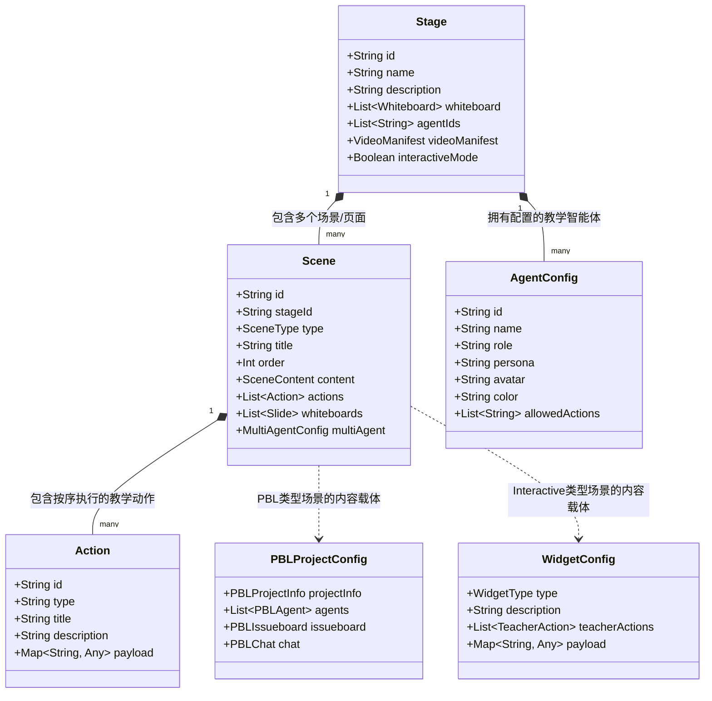
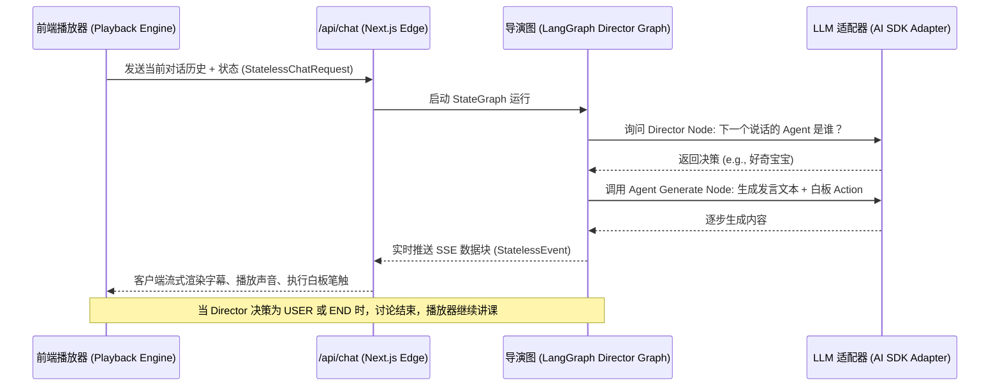
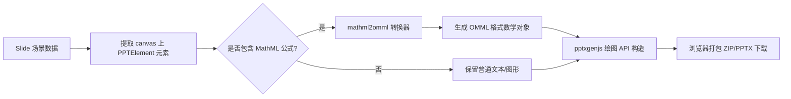

# 项目上下文与领域模型 (CONTEXT.md)

欢迎来到 **TDuMAIC**（Open Multi-Agent Interactive Classroom，开源多智能体互动课堂平台）项目。这是一个旨在将任意主题或文档一键转化为沉浸式、多智能体协作互动的 AI 教学平台。

本文档梳理了项目的核心业务场景、实体关系、核心术语以及数据流向与边界，帮助开发者快速理解系统架构与领域模型。

---

## 1. 核心业务场景与核心实体 (Domain Entities)

### 核心业务场景
TDuMAIC 围绕以下五大核心业务场景构建：
1. **互动课堂从零生成 (Classroom Generation Flow)**：用户输入简短的主题、上传 PDF/Word 等材料，配置参与角色并选择生成模式。AI 在后台通过两阶段流水线自动为用户定制出完整的结构化课堂内容。
2. **AI 讲师自主授课与白板演练 (Autonomous Playback & Action Execution)**：由主讲 AI 老师（AI teacher）按照生成的动作队列自主授课，通过语音讲解、高亮幻灯片元素、调起白板绘制图形、推导公式或编写代码。
3. **多智能体圆桌讨论 (Roundtable Discussion)**：授课过程中，AI 老师、AI 助教与多位 AI 学生（如显眼包、好奇宝宝、笔记员、思考者）针对特定概念展开流式的多角色语音圆桌辩论或白板协作，学生也可以实时插话互动。
4. **超维互动模式实验 (Interactive Widget & Ultra Mode)**：提供“手脑并用”的探究式学习环境。AI 老师通过引导动作指示学生完成物理/数学模拟实验、探索思维导图、挑战在线编程、进行 3D 分子/几何模型交互。
5. **项目制实践学习 (Project-Based Learning, PBL)**：AI 将传统教学转化为微型团队协作。用户扮演项目组成员，在 AI PM 和 AI 开发人员的协同下通过工单看板（Issueboard）共同解决任务，完成 AI 设定的评测挑战以推动项目落地。

---

### 核心实体关系图


### 核心实体 (Domain Entities)

*   **Stage (课堂/关卡)**
    代表整个互动课堂。作为最高层容器，持有课堂元数据（名称、描述、语言指令等）、多智能体参与者配置、全局视频清单（Video Manifest）以及与当前课程关联的所有白板（Whiteboard）资产。
*   **Scene (场景/页面)**
    课堂的最小逻辑关卡或页。每个 Scene 拥有一个展现类型 `SceneType`（共有 `slide` 幻灯片、`quiz` 测验、`interactive` 交互、`pbl` 项目制学习四种），并拥有专属于该页面的动作序列（`actions`）以驱动自动演示。
*   **Action (教学动作)**
    智能体与幻灯片或白板交互的唯一原子行为单元，分为两大类：
    *   *即发即弃型 (Fire-and-forget)*：对当前场景的视觉引导（如：`spotlight` 区域聚焦、`laser` 激光笔点拨）。
    *   *同步阻塞型 (Synchronous)*：执行必须独占通道，完毕后才继续下一步（如：`speech` 语音播报、`wb_open/wb_close` 白板开关、以打字机特效绘制/编辑代码及图表的各种 `wb_draw_*` 系列动作、`discussion` 触发讨论等）。
*   **Agent (教学智能体)**
    参与课堂交互的 AI 角色。具备唯一的标识、姓名、预设人格（Persona）、音色配置与被允许的 Action 集合。内置 6 种经典教学角色：
    *   `teacher` (主讲老师)：讲解、引导、操作幻灯片和白板。
    *   `assistant` (助教)：答疑解错，将复杂概念化繁为简。
    *   `student` (AI 学生)：包括“显眼包”（调动气氛）、“好奇宝宝”（提出深度问题）、“笔记员”（总结大纲要点）、“思考者”（推导逻辑与伦理关联）。
*   **PBL Project (PBL 项目制配置)**
    当场景类型为 `pbl` 时，代表一次微型协作项目。它包含项目描述、AI 成员（管理层/开发层）、由工单（PBLIssue）组成的项目任务看板（Issueboard），以及由工单触发的群聊（PBLChat）。
*   **Interactive Widget (交互式小部件)**
    当场景类型为 `interactive` 时的底层技术实体，分为 5 种模式：
    *   `simulation` (科学仿真实验)：基于核心公式的可调参数面板。
    *   `diagram` (思维导图与流程图)：包含节点与边的逐步展开（revealOrder）。
    *   `code` (在线编程挑战)：配置初始代码、隐藏/公开测试用例以及参考答案。
    *   `game` (游戏化测验)：带连击加分、积分机制的趣味问答。
    *   `visualization3d` (3D 可视化)：支持分子、天体、解剖或几何图形等 3D 材质、旋转动画与相机参数。

---

## 2. 关键业务术语表 (Domain Glossary)

| 术语 | 英文原文 | 定义与业务上下文 |
| :--- | :--- | :--- |
| **导演图** | **Director Graph** | 基于 `LangGraph` 构建的多智能体编排调度状态机。在圆桌讨论（discussion）激活时，由其决策当前该哪个 AI 智能体发言、何时将话筒交还给用户、或何时宣告讨论结束（END）。 |
| **播放引擎** | **Playback Engine** | 客户端的核心播放调度状态机。协调课堂在 `idle`（静止）、`playing`（正常播放动作序列）、`paused`（暂停）和 `live`（多智能体实时讨论/用户交互）状态间流转。 |
| **动作引擎** | **Action Engine** | 执行具体 Actions 的指令驱动器。负责在前端高保真地渲染打字机写代码、LaTeX 公式动画、高亮 spotlight 以及播放配合 TTS 音频的字幕。 |
| **白板账本** | **Whiteboard Ledger** | 智能体在授课和讨论中对白板进行的一系列增删改画的动作总账。用来持久化白板状态，并为大模型生成后续讨论提供上下文依据。 |
| **教师引导动作** | **Teacher Action** | 附加在交互小部件（Widget）上的标准化动作接口。允许 AI 老师直接操作 iframe 内部的变量状态（`setState`）、高亮节点（`highlight`）或展示解释，以此演示实验。 |
| **超维交互模式** | **Ultra Mode** | 与普通仅包含多智能体语音讨论的课堂相对。该模式下生成的页面以高度交互的 Sandbox/模拟器/3D 画布为核心，AI 智能体基于数据绑定与教师引导动作对科学原理进行动态演示。 |
| **MCP 工具包** | **MCP Tools** | 遵循模型上下文协议（Model Context Protocol）的工具集。在 PBL 模式中提供沙箱限制，允许 AI 代理通过接口操作 Issue 板、分配任务或更改项目状态，而不越界操作外部文件。 |
| **声音克隆 / 本地 AI** | **Lemonade & VoxCPM2** | 项目支持的本地和私有化 AI 引擎。Lemonade 提供免 Key 的本地 LLM、图像与 TTS 聚合接口；VoxCPM2 提供支持音色克隆的自托管语音生成模块。 |
| **增强文档解析** | **MinerU** | 专为 PDF 等复杂文档导入设计的 OCR 公式与表格提取解析器 API，帮助大纲生成阶段捕获更高质量的教学输入。 |

---

## 3. 目前可观测到的核心数据流与业务边界

### 核心数据流

#### 1. 互动课堂“从零生成”流水线 (Creation & Generation Pipeline)
这是用户进入平台最先触发的数据流。
```mermaid
flowchart TD
    A[用户输入: 主题/文档/设置] --> B[PDF文档解析 / MinerU 增强公式提取]
    B --> C[大纲生成器 Outline Generator]
    C -->|大纲 SceneOutline[]| D[场景生成器 Scene Generator]
    D -->|并行调用 LLM| E[生成各场景 Content]
    E -->|Slide / Quiz / Interactive / PBL| F[静态课件组装 & 关联 Actions]
    F --> G[持久化写入客户端 IndexedDB/Dexie 数据库]
```

#### 2. 多智能体圆桌讨论实时调度流 (Roundtable Discussion Stream Flow)
当播放引擎播放到 `DiscussionAction`，或用户主动在课堂打字/语音提问中断授课时，系统触发的流式实时响应调度流。


#### 3. PPTX 幻灯片离线导出数据流 (Slide PPTX Export Flow)
该数据流将 AI 生成的 canvas 幻灯片还原为标准的 Office 文档。


---

### 业务边界与设计约束

1.  **存储与运行的本地化边界 (Client-Server Separation)**
    *   *数据持久化*：所有的课堂结构（Stage/Scene）、作答进度、白板资产和局部设置均采用“客户端优先”设计，静默持久化在 IndexedDB（通过 Dexie）或 LocalStorage 中。
    *   *零安装分发*：生成的互动课堂支持一键导出为“离线 HTML”或带静态音频的“ZIP 包”，其底层播放引擎、Action 执行逻辑及小部件静态页面能够完全脱离服务端，在用户浏览器中直接离线离线完整播放。
2.  **主观判分与 AI 判定边界 (AI Grading Boundary)**
    *   对于包含正确选项的客观测验，系统完全在客户端完成判定（免 LLM）。
    *   对于主观问答题或 PBL 工单任务答复，前端将回答发送给服务端 `/api/quiz-grade`，委托给大模型基于“打分指引 (commentPrompt)”进行弹性判定，并将判卷结果存回客户端，将复杂的判题逻辑隔绝在核心课堂存储之外。
3.  **MCP（模型上下文协议）沙箱边界 (PBL Sandboxed Tools)**
    *   在 PBL 模式下，AI 智能体可以通过 MCP 工具接口（如 `issueboard-mcp`、`project-mcp` 等）操纵该任务内部的协同看板、分配工单、追加讨论。
    *   这些 MCP 工具由项目制沙箱进行严格限制，**不允许**其读写本地文件系统或网络外的实体资源，从而确保了多智能体模拟团队协作时的运行安全。
