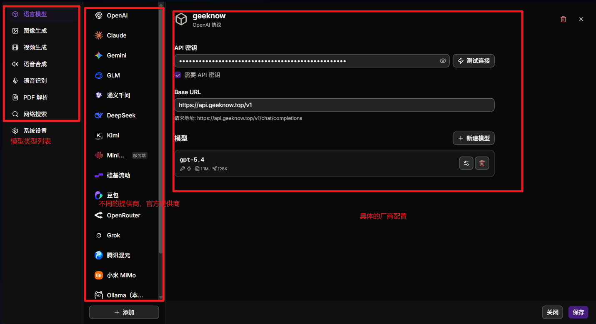

# AI服务配置详细说明

## 一：重点说明

### 1. AI服务配置说明

***文本大模型是地基**。您必须先配置至少一个文本大模型服务商（如 Gemini, OpenAI 或通义千问等），才能解锁生成课程幻灯片的基本功能。在此基础上，如果您希望课堂“有声有色”，再对应配置语音合成 (TTS) 和图像生成服务。如果还希望课堂”有视频演示”,就需要视频生成服务。*

### 2. 官方提供商说明

现在平台提供了文本生成, 视频生成, 图像生成,语音合成,语音识别,PDF解析，网络搜索等大模型的提供商配置，而且提供的提供商都是官方的，比较稳定，需要用户自己填写提供商的模型配置。

这一步，请从提供商的官方网站来获取api key和api url等，再填入。

### 3. 中转站提供商说明

如果用户试用的算力平台不在以上的官方提供商中，请自行添加自己的中转站提供商的配置，确保协议,baseurl, apikey是正确的即可，见下面详细使用说明。

<aside>
💡

注意：只支持主流的openai, anthropic, gemini的协议，不支持特定的自定义的协议

</aside>

### 二：中转站提供商配置

### 1. 准备中转站提供商

此处准备的中转站提供商为geeknow和zlhub，由于

| 中转站提供商 | baseurl | api key | 服务协议 | 使用的模型id |
| --- | --- | --- | --- | --- |
| geeknow | [https://api.geeknow.top/v1](https://api.geeknow.top/v1) | 自行找管理员提供 | openai | 文本: gpt-5.4
图片: gpt-image-2
视频: 暂无 |
| zlhub | [https://www.zlhub.cn/](https://www.zlhub.cn/) | 自行找管理员提供 | seedance协议 | 视频: doubao-seedance-2.0 |

### 2. 配置文本大模型

使用geeknow中转站提供商的文本大模型:gpt-5.4

点击添加，会看到提供商列表中多了一个geeknow的提供商，选中这个提供商，然后配置api key和模型id。

模型配置之后，就可以点击”测试连接”按钮，出现如下界面，表示配置成功

### 3. 配置图片大模型

使用geeknow中转站提供商的图片大模型:gpt-image-2.0, 本身中转站的上游接入的是openai的gpt-image-2.0, 所以直接使用openai官方的提供商，然后再配置好apikey和baseurl即可。

### 4. 配置语音大模型

geeknow和zlhub中转站没有提供响应的语音模型，所以可以使用浏览器自带的语音

### 5. 配置视频大模型

使用zlhub中转站提供商的视频大模型: doubao-seedance-2.0  本身中转站的上游接入的是doubao的gpt-image-2.0, 所以直接使用doubao官方的提供商，然后再配置好apikey和baseurl,以及模型id即可。

### 6. 配置ASR服务(语音识别)

使用默认的浏览器原生ASR服务即可

### 7. 配置PDF解析服务

使用默认的unPDF即可。

配置完成后，回到主页

## 三：主页选择配置的模型

选中以上配置好的大模型，并开启对应的服务。

### 1. 选择文本模型

### 2. 选择图片模型

### 3. 选择视频模型

### 4. 选择音频模型

选择老师，助手，以及学生等的音色。

有效音色列表:

最终如下:

## 四：生成课堂

### 1. 选择参考文档

如果上传了参考文档，AI会根据你上传的参考文档来生成课堂。如果不上传，就会由AI自动生成某个主题的课堂。

### 2. 生成课堂

## 五：常见问题

### 1. 生成失败

如果出现这种生成失败的问题，一般是中转站提供的图片或视频的协议有特定的方式，不是正宗的官方协议，或者中转站的速率以及网络限制等。

所以最好的方法是使用minimax官方提供商，包含文本,视频,图片,语音等大模型。但要确保有充值。